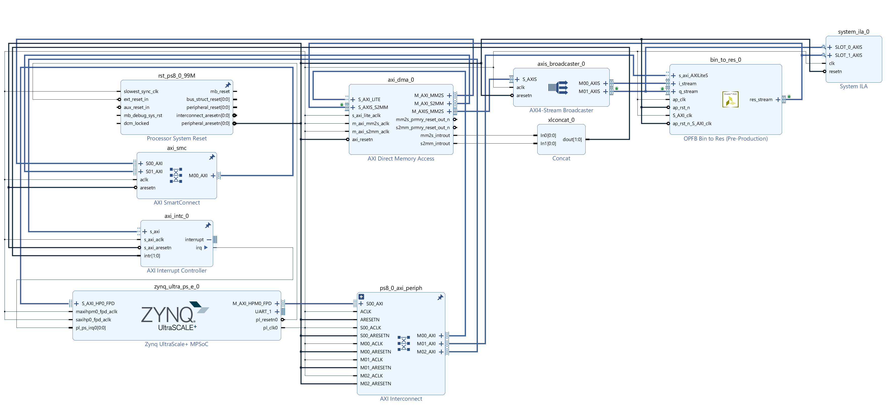

# opfb-bin-to-res
Converts the stream of OPFB IQ bins into a stream of raw resonator IQ values

Git:  [opfb-bin-to-res](https://github.com/MazinLab/opfb-bin-to-res)

Inputs: 
- 2 288bit AXI4S of 16 18 bit numbers (I and Q streams), both equipped with TLAST
- AXI-Lite resonator map port (256x8 ap_uint<12> array).

Outputs:
- 1 288bit AXI4S of 8 18 bit complex equipped with TLAST and possibly (TODO) TKEEP

Interface:

    void bin_to_res(opfb_stream_t &i_stream, opfb_stream_t &q_stream,
                    resstream_t &res_stream, binndx_t rid_to_bin[N_GROUPS][N_RES_PCLK]) {
    #pragma HLS PIPELINE II=1
    #pragma HLS INTERFACE axis register reverse port=i_stream
    #pragma HLS INTERFACE axis register reverse port=q_stream
    #pragma HLS INTERFACE axis register forward port=res_stream
    #pragma HLS INTERFACE s_axilite port=rid_to_bin clock=S_AXI_clk name=data bundle=resmap
    #pragma HLS INTERFACE ap_ctrl_none port=return
    #pragma HLS ARRAY_RESHAPE variable=rid_to_bin complete dim=2

This block ingests the IQ bins output by the OPFB subsystem and caches them round-robin into a heavily partitioned buffer:

    static iq_t cache[N_RES_PCLK][N_PFB_BINS];
    #pragma HLS DATA_PACK variable=cache
    #pragma HLS ARRAY_PARTITION variable=cache cyclic factor=16 dim=2
    #pragma HLS ARRAY_PARTITION variable=cache complete dim=1
    
The iq_t type is a std:complex< ap_uint<18> > that is packed into a 2D array. Dimension one is 8 and fully partitioned (one buffer per output lane), dimension 2 is partitioned cyclically with factor 16, ensuring that each of the 16 arriving, consecutive  I and Q values each clock may be 
written into the cache that clock while each cache retains an unused port for reading an address. NB 4096 bins, 16 per clock, 256 cycles) 

        for (unsigned int i=0; i<N_BIN_PCLK; i++){
            iq_t iq=iq_t(i_in.data[i], q_in.data[i]);
            for (int j=0;j<N_RES_PCLK;j++) cache[j][group*N_BIN_PCLK+i]=iq;
        }

Each cycle the core outputs 8 cache values corresponding to the bins for the next 8 resonators (8 per clock 2048 res, 256 cycles). The bin addresses are loaded from the resonator map port.

    resstream_t temp;
    temp.last=group==N_GROUPS-1;
    for (unsigned int i=0; i<N_RES_PCLK; i++)
        temp.data[i]=cache[i][rid_to_bin[group][i]];
    res_stream=temp;

This allows any resonator to be drawn from any bin and, though it does not matter for correctness, it should be notes that depending on the values assigned to resonator map  resonators may be drawn from both before and after the current cache write address and thus be 256 cycles out of phase. 

The resonator map can be programmed directly from PYNQ using mkidgen3.blocks.Bin2ResBlock (see [mkidgen3](https://github.com/MazinLab/MKIDGen3)). An example block diagram for testing the core is contained in (gen3-reschan)[] and looks roughly like 
